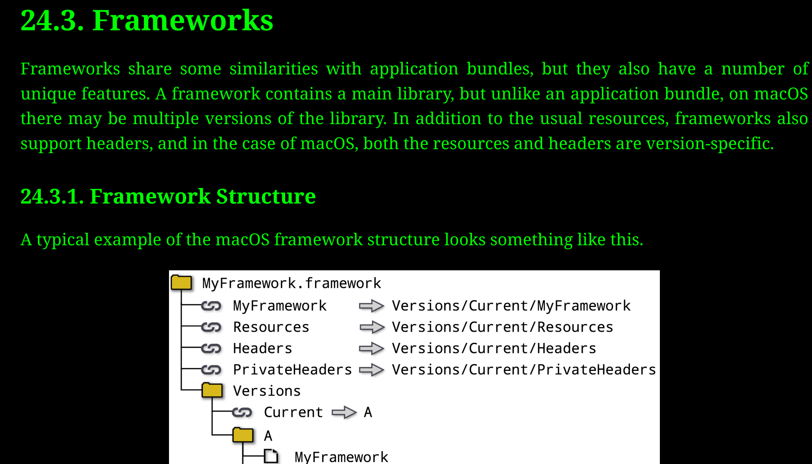

# Build Type in CPP

keyword: static, dynamic, framework
<!-- markdown-toc start - Don't edit this section. Run M-x markdown-toc-refresh-toc -->
**Table of Contents**

- [Build Type in CPP](#build-type-in-cpp)
    - [More details](#more-details)
    - [Hello World library - both as static and dyanmic](#hello-world-library---both-as-static-and-dyanmic)
    - [How about Framework](#how-about-framework)
        - [What is a Framework?](#what-is-a-framework)
        - [Using Frameworks in CMakeLists.txt](#using-frameworks-in-cmakeliststxt)
        - [Using Frameworks in the Command Line](#using-frameworks-in-the-command-line)
        - [Features, Usages, and Common Practices for Frameworks:](#features-usages-and-common-practices-for-frameworks)
        - [Common Frameworks for macOS:](#common-frameworks-for-macos)
    - [Static Linking vs Dynamic Linking](#static-linking-vs-dynamic-linking)
    - [Static Linking:](#static-linking)
        - [-](#-)
        - [Disadvantages:](#disadvantages)
        - [File Extensions:](#file-extensions)
    - [Dynamic Linking:](#dynamic-linking)
        - [-](#--1)
        - [Disadvantages:](#disadvantages-1)
        - [File Extensions:](#file-extensions-1)
        - [Can youy create simple library and link it using static then dynamicc?](#can-youy-create-simple-library-and-link-it-using-static-then-dynamicc)
        - [1. Creating the Library:](#1-creating-the-library)
        - [2. Static Linking:](#2-static-linking)
        - [Dynamic Linking:](#dynamic-linking-1)

<!-- markdown-toc end -->


- Here's a table that compares dynamic libraries and static libraries in various aspects:

| **Aspect**                     | **Dynamic Library**                                                                                                | **Static Library**                                                                                  |
| ------------------------------ | ------------------------------------------------------------------------------------------------------------------ | --------------------------------------------------------------------------------------------------- |
| **Description**                | Libraries that are loaded at runtime.                                                                              | Libraries that are linked at compile time.                                                          |
| **Extension**                  | Typically `.dll` (Windows), `.so` (Linux), `.dylib` (macOS).                                                       | Typically `.lib` (Windows), `.a` (Unix/Linux/macOS).                                                |
| **Linking Type**               | Dynamic Linking                                                                                                    | Static Linking                                                                                      |
| **Size of Executable**         | Generally smaller, as the actual library code resides in the shared library.                                       | Larger, as the library code is incorporated into the final executable.                              |
| **Memory Footprint**           | Multiple programs can share a single instance in memory.                                                           | Each program has its own copy of the library functions in memory.                                   |
| **Loading Time**               | May increase, as linking is done at runtime.                                                                       | Typically faster, as all linking is done at compile time.                                           |
| **Versioning**                 | Can update without recompiling dependent applications (if ABI is preserved).                                       | Applications must be recompiled if the library is updated.                                          |
| **Portability**                | Executable needs the correct version of the library present at runtime.                                            | No external dependencies are required at runtime.                                                   |
| **Performance**                | Slight overhead due to dynamic linking, though often negligible.                                                   | Might be slightly faster due to early binding.                                                      |
| **Compilation Time**           | Might be faster as each change to the library doesn't require recompiling dependent applications.                  | Could be slower, especially if the library is large and the application needs to be relinked often. |
| **Code Snippet (Compilation)** | `gcc -shared -o libmylib.so mylib.c` (Linux)                                                                       | `ar rcs libmylib.a mylib.o` (after compiling `mylib.c` to object file)                              |
| **Code Snippet (Linking)**     | `gcc -o myprog myprog.c -L/path/to/lib -lmylib` (dynamic linking in Linux)                                         | `gcc -o myprog myprog.c -L/path/to/lib -lmylib` (static linking)                                    |
| **Distribution**               | Must distribute the library and the executable. Also, may need to consider version compatibility.                  | Only the executable is distributed.                                                                 |
| **Use Case**                   | When you expect updates to the library without wanting to recompile all dependent applications. Also, for plugins. | When you want a standalone executable without any external dependencies.                            |

**Notes:**

1. The above table provides a general overview. The specifics can vary based on
   the operating system, compiler, and specific use cases.
2. Dynamic libraries also have the concept of an "Application Binary Interface"
   (ABI). If you maintain ABI compatibility, you can update a dynamic library
   without recompiling programs that use it. However, if you break ABI
   compatibility, it requires recompilation.
3. Always consider licensing when distributing libraries. Some licenses have
   different requirements or implications for static vs. dynamic linking.

- **Note**: The "Compilation Time" aspect is a general observation and the actual
  compilation time can vary based on the size of the library, the number of
  dependencies, and the specific system and build setup.

## More details

**Static Linking** and **Dynamic Linking** are two processes of collecting and
combining multiple object files to form a single executable.

1. In **static linking**, all library routines used by a program are copied
   into the program's binary file during the linking phase. This makes the
   executable file self-contained, it can run independently without any external
   dependencies. But the disadvantage is the larger file size and possible
   duplication of code if multiple programs use the same library.
2. In **dynamic linking**, the linker doesn't copy the library routines into
   the executable file. Instead, references to the library routines are made in
   the executable file. The actual linking happens at runtime when both the
   executable and the library are in memory. Dynamic linking reduces the size of
   the executable and allows library routines to be shared among multiple
   programs, reducing memory usage.

- The extension for libraries and executable files differ depending on the
  operating system.
  - **Windows**: Static libraries usually have a `.lib` extension and dynamic
    libraries use the `.dll` (Dynamic Link Library) extension. Executables
    typically have `.exe` extensions.
  - **Linux**: Static libraries typically have a `.a` (archive) extension, and
    dynamic libraries have a `.so` (shared object) extension. Executables don't
    have a required extension in Linux.
  - **Mac**: Static libraries typically have a `.a` extension, and dynamic
    libraries have a `.dylib` extension. Similar to Linux, executables don't have
    a required extension in macOS.

These are just the usual conventions. It's possible to configure the build process to use other extensions or even no extensions at all.

## Hello World library - both as static and dyanmic

let's create a simple "Hello World" library, both as a static library and a
dynamic library.

1. **Library Code (`hello.cpp`)**

```cpp
#include <iostream>

void hello() {
    std::cout << "Hello, World from the library!" << std::endl;
}
```

2. **Static Library Compilation**:

To create a static library:

```bash
g++ -c hello.cpp -o hello.o
ar rcs libhello.a hello.o
```

3. **Dynamic Library Compilation**:

To create a dynamic/shared library:

```bash
g++ -shared -fPIC hello.cpp -o libhello.so
```

4. **Using the Libraries in a Main Program (`main.cpp`)**

```cpp
extern void hello();

int main() {
    hello();
    return 0;
}
```

5. **Linking with the Static Library**:

```bash
g++ main.cpp -L. -lhello -o static_hello
```

6. **Linking with the Dynamic Library**:

```bash
g++ main.cpp -L. -lhello -o dynamic_hello
```

- Make sure the dynamic library is in the library path or in the same directory
  when running the executable, or use `LD_LIBRARY_PATH`:

```bash
export LD_LIBRARY_PATH=.:$LD_LIBRARY_PATH
./dynamic_hello
```

**Comparison Table**:

| **Aspect**          | **Static Library**                                                                  | **Dynamic Library**                                                                                                                  |
| ------------------- | ----------------------------------------------------------------------------------- | ------------------------------------------------------------------------------------------------------------------------------------ |
| **Compilation**     | Two steps: Compile source to object file, then archive object files into a library. | Compile with `-shared` to directly create the shared library.                                                                        |
| **Linking**         | Library content is included in the final executable.                                | Only references to library functions are included. Library must be present at runtime.                                               |
| **Executable Size** | Generally larger, as library content is embedded inside it.                         | Smaller. The actual library code is in the shared library, not the executable.                                                       |
| **Distribution**    | Just the executable is required.                                                    | Both the executable and the shared library (.so, .dll) must be distributed.                                                          |
| **Update Library**  | Need to relink and possibly recompile the executable.                               | Just replace the shared library file (if ABI compatibility is maintained).                                                           |
| **Performance**     | No overhead of dynamic linking at runtime.                                          | Minimal overhead due to dynamic linking, but generally negligible.                                                                   |
| **Flexibility**     | Not as flexible. Changing the library requires relinking the executable.            | More flexible. Applications can use different versions or implementations of a library without needing to be recompiled or relinked. |

This table provides a general comparison between static and dynamic libraries in the context of a "Hello World" library. The exact benefits and trade-offs can vary based on the specific use-case and system setup.

## How about Framework

- Framework is a bundle, usually in `macOS`, read more about it in the
  `CMake_for_Professional` book.



### What is a Framework?

A framework in the context of software development is a pre-written set of code
or tools that provides generic functionality, upon which more specific software
can be built. Frameworks enable developers to avoid "reinventing the wheel" by
offering a structure and foundation for building applications.

**Examples**:

1. **Web Development**: Django is a high-level Python web framework that
   encourages rapid development and clean, pragmatic design.
2. **Mobile Development**: SwiftUI is a framework for building UIs across all
   Apple devices with the power of Swift.
3. **Desktop Development**: Qt is a free and open-source widget toolkit for
   creating GUIs as well as cross-platform applications that run on various
   software and hardware platforms.

### Using Frameworks in CMakeLists.txt

When using a framework in CMake, you typically use the `find_package` command
to locate the framework, and then link against it.

**Example** (using a hypothetical "MyFramework"):

```cmake
# Find the MyFramework package
find_package(MyFramework REQUIRED)

# Link against MyFramework when creating your executable or library
add_executable(my_app main.cpp)
target_link_libraries(my_app PRIVATE MyFramework::MyFramework)
```

### Using Frameworks in the Command Line

When you're compiling a program from the command line, you often have to
specify where the compiler can find the framework headers and libraries. In
macOS, frameworks are typically bundled in a `.framework` directory.

**Example** (using a hypothetical "MyFramework"):

```bash
g++ main.cpp -F /path/to/framework/directory -framework MyFramework -o my_app
```

- In the above, `-F` specifies the path to search for frameworks and
  `-framework` is used to link against a specific framework.

### Features, Usages, and Common Practices for Frameworks:

| **Feature**                     | **Description**                                                                                       | **Common Practices**                                                                                                |
| ------------------------------- | ----------------------------------------------------------------------------------------------------- | ------------------------------------------------------------------------------------------------------------------- |
| **Structure and Organization**  | Provides a predefined structure for organizing code, resources, and other assets.                     | Stick to the structure provided by the framework for maintainability and better collaboration.                      |
| **Reusable Components**         | Contains pre-built components or modules that can be reused across different parts of an application. | Use the built-in components before trying to build custom solutions; it saves time and ensures consistency.         |
| **Documentation and Community** | Often comes with extensive documentation and a supportive community.                                  | Regularly consult the official documentation; participate in community forums or discussion boards for support.     |
| **Extensibility**               | Allows developers to extend or override built-in functionality to cater to specific requirements.     | Use extension points provided by the framework; avoid "hacking" or working against the framework's design.          |
| **Testing and Debugging**       | Often includes tools or modules for testing and debugging to ensure the application works correctly.  | Regularly write tests as you develop; utilize built-in debugging tools for efficient troubleshooting.               |
| **Updates and Maintenance**     | Regularly receives updates, which might include new features, bug fixes, or performance improvements. | Stay updated with the latest version; however, always test the application thoroughly after updating the framework. |

### Common Frameworks for macOS:

| **Framework**          | **Description**                                                                                         | **Common Use Cases**                                                   |
| ---------------------- | ------------------------------------------------------------------------------------------------------- | ---------------------------------------------------------------------- |
| **Cocoa/Cocoa Touch**  | Apple's native object-oriented APIs for macOS/iOS UI development.                                       | Building native macOS and iOS applications.                            |
| **Core Foundation**    | C-based framework by Apple that provides data types and utilities for macOS and iOS.                    | Used for low-level operations in macOS and iOS development.            |
| **Metal**              | High-performance graphics and compute API by Apple.                                                     | Game development, graphics-intensive apps, and compute tasks on macOS. |
| **WebKit**             | The web rendering engine behind Safari, used for embedding web content in apps.                         | Building web browsers or embedding web content within native apps.     |
| **Core ML**            | Apple's machine learning framework for adding trained ML models into applications.                      | Implementing machine learning features in macOS/iOS apps.              |
| **SceneKit/SpriteKit** | Graphics rendering and animation infrastructure for creating 3D (SceneKit) and 2D (SpriteKit) graphics. | Game development and 3D/2D graphics on macOS/iOS.                      |

- Frameworks serve as a foundational layer or a scaffold upon which developers
  build their applications. They provide a consistent and structured way to build
  applications, enabling developers to focus on the unique aspects of their
  application rather than the repetitive or common functionalities.

## Static Linking vs Dynamic Linking

Static linking and dynamic linking are two methods of linking libraries to an
application. Each method has its pros and cons, and the choice between them
often depends on the specific requirements of the application or the
preferences of the developer. Here's a comparison between static and dynamic
linking, along with the file extensions associated with each for macOS,
Windows, and Linux:

## Static Linking:

#### Advantages:

1. **Portability**: The application can run on any system without needing
   external libraries since all dependencies are included within the
   executable.
2. **Simplified Distribution**: No need to manage and ship shared libraries
   separately.
3. **Stable Versioning**: Your application will always use the version of the
   library it was linked with, avoiding potential issues with incompatible
   library updates.

#### Disadvantages:

1. **Larger Executable Size**: All required library code is embedded in the
   application, making the binary size larger.
2. **No Shared Memory**: Multiple applications using the same library can't
   share a single in-memory copy of the library.
3. **Update Difficulties**: To update a library, you have to recompile and
   redistribute the entire application.

#### File Extensions:

- **macOS**: `.a` (archive libraries)
- **Windows**: `.lib` (when used as a static library)
- **Linux**: `.a`

## Dynamic Linking:

#### Advantages:

1. **Smaller Executable Size**: The application only includes references to
   external shared libraries, not the library code itself.
2. **Shared Memory**: Multiple applications can share a single in-memory copy
   of the library, saving memory.
3. **Easier Updates**: Library updates can be made without needing to recompile
   applications that use them, as long as the library remains
   backward-compatible.

#### Disadvantages:

1. **Dependency Management**: The application requires external shared
   libraries to run. If a required library is missing or incompatible, the
   application will fail to start.
2. **Versioning Issues**: If an application expects a specific version of a
   library and the system has a different, incompatible version, the
   application might not work correctly.
3. **Potential Security Risks**: If an attacker replaces the shared library
   with a malicious version, applications using that library could be
   compromised.

#### File Extensions:

- **macOS**: `.dylib`
- **Windows**: `.dll` (Dynamic Link Library)
- **Linux**: `.so` (Shared Object)

In summary, the choice between static and dynamic linking will depend on the
specific needs of your project. If you prioritize a self-contained, portable
application without external dependencies, static linking might be the way to
go. On the other hand, if you want a smaller executable size and easier library
updates, dynamic linking could be a better choice.

#### Can youy create simple library and link it using static then dynamicc?

Here's a step-by-step guide on creating a simple library, followed by
instructions on how to link it both statically and dynamically, specifically
for macOS:

### 1. Creating the Library:

Let's create a simple library that provides a function to square a number.

**mathlib.h**:

```c
#ifndef MATHLIB_H
#define MATHLIB_H

int square(int x);

#endif
```

**mathlib.c**:

```c
#include "mathlib.h"

int square(int x) {
    return x * x;
}
```

### 2. Static Linking:

Compile the source file to an object file, then create a static library:

```bash
gcc -c mathlib.c -o mathlib.o
ar rcs libmathlib.a mathlib.o
```

This will produce a static library file named `libmathlib.a`.

Now, let's create a simple program that uses the library.

**main.c**:

```c
#include <stdio.h>
#include "mathlib.h"

int main() {
    printf("Square of 5: %d\n", square(5));
    return 0;
}
```

Compile the main program and link it with the static library:

```bash
gcc main.c -L. -lmathlib -o main
```

Run the program:

```bash
./main
```

This should output `Square of 5: 25`.

### 3. Dynamic Linking:

To create a dynamic library:

```bash
gcc -shared -o libmathlib.dylib mathlib.c
```

This will produce a dynamic library named `libmathlib.dylib`.

Compile the main program and link it with the dynamic library:

```bash
gcc main.c -L. -lmathlib -o main
```

Before running the program, you need to ensure the OS knows where to find your
dynamic library. You can temporarily set the library path as:

```bash
export DYLD_LIBRARY_PATH=.:$DYLD_LIBRARY_PATH
```

Run the program:

```bash
./main
```

Again, this should output `Square of 5: 25`.

Remember, static libraries (`.a` files) include the library's code directly in
the application, resulting in a standalone executable. Dynamic libraries
(`.dylib` files), on the other hand, are separate files that the application
loads at runtime, which means they need to be accessible to the application
either via standard library paths or through paths like `DYLD_LIBRARY_PATH` for
macOS.
