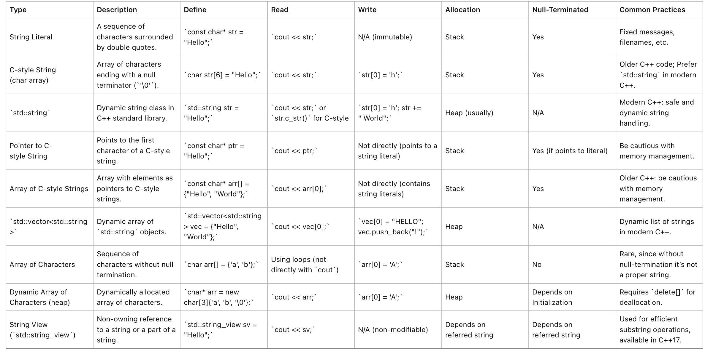

# String premier in CPP - In depth

## Content

<!-- markdown-toc start - Don't edit this section. Run M-x markdown-toc-refresh-toc -->

**Table of Contents**

- [String premier in CPP - In depth](#string-premier-in-cpp---in-depth)
  - [Content](#content)
  - [Types of string - Commonly used](#types-of-string---commonly-used)

<!-- markdown-toc end -->

## String in cpp all methods

In C++, the `string` class is a part of the Standard Library, defined in the
header file `<string>`. It represents a sequence of characters and provides
various methods to manipulate and query strings. The `string` class simplifies
many of the complexities of working with raw C-style character arrays.

Here's an overview of the `string` class in C++, including its methods and common ways to use it:

### **Construction**:

- Default constructor: `string()`
- Copy constructor: `string(const string& str)`
- Substring constructor: `string(const string& str, size_t pos, size_t len = npos)`
- From C-string: `string(const char* s)`
- Repeat character: `string(size_t n, char c)`

### **Element Access**:

- `at(size_t pos)`: Returns character at the specified position.
- `operator[]`: Access character at a specified position.
- `front()`: Returns the first character.
- `back()`: Returns the last character.
- `c_str()`: Returns a C-style character string.
- `data()`: Returns a pointer to the string data.

### **Modifiers**:

- `append()`: Append string.
- `push_back()`: Append character.
- `assign()`: Assign new content to the string.
- `insert()`: Insert content.
- `erase()`: Erase characters.
- `replace()`: Replace part of the string.
- `swap()`: Swap string values.
- `pop_back()`: Deletes the last character.

### **Capacity**:

- `size()` or `length()`: Return length.
- `resize()`: Change the size.
- `capacity()`: Returns the size of allocated storage.
- `reserve()`: Request a change in capacity.
- `clear()`: Clears the string.
- `empty()`: Checks if the string is empty.
- `shrink_to_fit()`: Reduces memory usage by freeing unused memory.

### **Operations**:

- `substr()`: Returns a substring.
- `copy()`: Copy sequence of characters from string.
- `c_str()`: Returns a null-terminated character sequence.
- `find()`: Find content in string.
- `rfind()`: Find last occurrence of content in string.
- `find_first_of()`: Find character in string.
- `find_last_of()`: Find the last character in string.
- `find_first_not_of()`: Find character not in string.
- `find_last_not_of()`: Find the last character not in the string.
- `compare()`: Compare strings.

### **Relational Operators**:

Strings can be compared using relational operators like `==`, `!=`, `<`, `<=`, `>`, and `>=`.

### **Iterators**:

- `begin()`: Returns an iterator pointing to the first character.
- `end()`: Returns an iterator pointing to the past-the-end character.
- `rbegin()`, `rend()`: Reverse iterators.
- `cbegin()`, `cend()`, `crbegin()`, `crend()`: Constant iterators.

### **Numeric Conversions**:

- `stoi()`: Convert string to integer.
- `stol()`, `stoll()`: Convert string to long and long long.
- `stof()`, `stod()`, `stold()`: Convert string to float, double, and long double.
- `to_string()`: Convert numeric types to string.

### **Allocator**:

- `get_allocator()`: Returns the allocator object.

### **Member Constants**:

- `npos`: Represents the maximum size of the string, used for "until the end of the string" in various methods.

### Common Usage Patterns:

1. **String Concatenation**:

   ```cpp
   string hello = "Hello";
   string world = " World!";
   string greeting = hello + world;
   ```

2. **String Iteration**:

   ```cpp
   for(char c : greeting) {
       cout << c;
   }
   ```

3. **Substrings and Searching**:

   ```cpp
   size_t pos = greeting.find("World");
   string sub = greeting.substr(pos, 5);
   ```

4. **Conversion**:
   ```cpp
   string numStr = "12345";
   int num = stoi(numStr);
   ```

This overview covers most of the string class's capabilities in C++. However,
the best way to fully understand and grasp its depth is to refer to the
official documentation or a C++ reference and try out various methods and
operations for yourself.

## Explain the char and sting lateral in general

Certainly! Let's delve into string literals and character literals in C++.

### Character Literals:

A character literal represents a single character and is enclosed in single
quotes. In C++, a character literal has type `char`.

Examples:

- `'a'`
- `'1'`
- `'%'`

There are also some special character literals called escape sequences:

- `'\n'`: Newline
- `'\t'`: Tab
- `'\r'`: Carriage return
- `'\''`: Single quote
- `'\"'`: Double quote
- `'\0'`: Null character
- `'\b'`: Backspace

#### Wide and Unicode Character Literals:

- `wchar_t` is used for wide character literals and is prefixed by `L`, e.g.,
  `L'Z'`.
- C++11 introduced `char16_t` for UTF-16 encoded characters with prefix `u`,
  e.g., `u'Z'` and `char32_t` for UTF-32 encoded characters with prefix `U`,
  e.g., `U'Z'`.

### String Literals:

A string literal is a sequence of characters surrounded by double quotes. The
compiler appends a null character (`'\0'`) to every string literal, making it a
null-terminated string.

Examples:

- `"Hello, World!"`
- `"C++ Programming"`
- `"12345"`

Similar to character literals, string literals also support escape sequences:

- `"This is a string with a newline character.\n"`

#### Raw String Literals:

C++11 introduced raw string literals that allow you to write string literals
without escaping characters. This is particularly useful for regex patterns,
path specifications, or any multi-line string content. They are denoted by `R`
and surrounded by `"( )"`.

Example:

- `R"(This is a "raw" string. No need to escape the "double quotes".)"`
- `R"(C:\Path\To\Directory)"` (notice no need to double backslash)

#### Wide and Unicode String Literals:

- Wide string literals use `wchar_t` and are prefixed by `L`, e.g., `L"Hello"`.
- UTF-8 string literals (C++11) use `char` and are prefixed by `u8`, e.g., `u8"Hello"`.
- UTF-16 string literals use `char16_t` and are prefixed by `u`, e.g., `u"Hello"`.
- UTF-32 string literals use `char32_t` and are prefixed by `U`, e.g., `U"Hello"`.

### Distinction Between String Literals and `std::string`:

It's crucial to understand that string literals (e.g., `"Hello"`) are of type `const char[]`. On the other hand, the `std::string` type from the C++ Standard Library is a class designed to handle strings, providing many utility functions. They can be implicitly converted, so you often see them being used interchangeably:

```cpp
#include <string>

std::string str = "This is a string literal assigned to a std::string object.";
```

In the example above, the string literal `"This is a string literal assigned to a std::string object."` is automatically converted to a `std::string` object.

## Types of string - Commonly used

Extended table for `string` in `C++`.

| **Type/Method**          | **Description**                          | **Memory**   | **Mutable** | **R/W** | **Size Specified** | **Example**                                                  | **Usage & Common Practices**                                       |
| ------------------------ | ---------------------------------------- | ------------ | ----------- | ------- | ------------------ | ------------------------------------------------------------ | ------------------------------------------------------------------ |
| C-style array            | Fixed-size, contiguous block of memory.  | Stack        | Yes         | R/W     | Yes (`[N]`)        | `int arr[3] = {1, 2, 3};`                                    | Prefer `std::array` or `std::vector` for safety and flexibility.   |
| Dynamic C-style array    | Dynamically-allocated array.             | Heap         | Yes         | R/W     | No (`[]`)          | `int* arr = new int[3]; arr[0] = 1;`                         | Use with caution; must manually manage memory with `delete[]`.     |
| `std::array<T, N>`       | Fixed-size, stack-allocated.             | Stack        | Yes         | R/W     | Yes (`<T, N>`)     | `std::array<int, 3> arr = {1, 2, 3};`                        | Preferred over C-style array for fixed-size lists.                 |
| `std::vector<T>`         | Dynamic array with auto-resizing.        | Heap & Stack | Yes         | R/W     | No (at creation)   | `std::vector<int> vec = {1, 2, 3};`                          | Most common dynamic list in C++; handles memory management.        |
| `std::list<T>`           | Doubly-linked list.                      | Heap         | Yes         | R/W     | No (at creation)   | `std::list<int> lst = {1, 2, 3};`                            | Use when frequent insertions/deletions are required in the middle. |
| Pointer to C-style array | Points to the first element of an array. | Depends      | Depends     | R/W     | Depends            | `int nums[3] = {1, 2, 3}; int* p = nums;`                    | Raw pointers can be error-prone; prefer modern alternatives.       |
| Array of pointers        | Array where each element is a pointer.   | Stack        | Yes         | R/W     | Yes (`[N]`)        | `int* arr[3]; for(int i=0; i<3; i++) arr[i] = new int(i+1);` | Use when needing an array of objects on the heap.                  |

**Notes:**

- **Size Specified**: This column indicates whether you must specify the size
  of the array/list at compile-time or not. For data structures where the size
  isn't specified at compile-time, it often means the size can be dynamically
  adjusted at runtime.
- **Memory Management**: As previously mentioned, always ensure to release any
  heap-allocated memory to prevent memory leaks.
- **Safety**: Using modern C++ containers is recommended for most use-cases due
  to their safety, flexibility, and the functionalities they provide.



## More details

- I'll add a few more scenarios related to string handling in C++:

| **Type**                               | **Description**                                             | **Define**                                           | **Read**                                    | **Write**                                 | **Allocation**             | **Null-Terminated**        | **Common Practices**                                           |
| -------------------------------------- | ----------------------------------------------------------- | ---------------------------------------------------- | ------------------------------------------- | ----------------------------------------- | -------------------------- | -------------------------- | -------------------------------------------------------------- |
| **String Literal**                     | A sequence of characters surrounded by double quotes.       | `const char* str = "Hello";`                         | `cout << str;`                              | N/A (immutable)                           | Stack                      | Yes                        | Fixed messages, filenames, etc.                                |
| **C-style String (char array)**        | Array of characters ending with a null terminator (`'\0'`). | `char str[6] = "Hello";`                             | `cout << str;`                              | `str[0] = 'h';`                           | Stack                      | Yes                        | Older C++ code; Prefer `std::string` in modern C++.            |
| **`std::string`**                      | Dynamic string class in C++ standard library.               | `std::string str = "Hello";`                         | `cout << str;` or `str.c_str()` for C-style | `str[0] = 'h'; str += " World";`          | Heap (usually)             | N/A                        | Modern C++: safe and dynamic string handling.                  |
| **Pointer to C-style String**          | Points to the first character of a C-style string.          | `const char* ptr = "Hello";`                         | `cout << ptr;`                              | Not directly (points to a string literal) | Stack                      | Yes (if points to literal) | Be cautious with memory management.                            |
| **Array of C-style Strings**           | Array with elements as pointers to C-style strings.         | `const char* arr[] = {"Hello", "World"};`            | `cout << arr[0];`                           | Not directly (contains string literals)   | Stack                      | Yes                        | Older C++: be cautious with memory management.                 |
| **`std::vector<std::string>`**         | Dynamic array of `std::string` objects.                     | `std::vector<std::string> vec = {"Hello", "World"};` | `cout << vec[0];`                           | `vec[0] = "HELLO"; vec.push_back("!");`   | Heap                       | N/A                        | Dynamic list of strings in modern C++.                         |
| **Array of Characters**                | Sequence of characters without null termination.            | `char arr[] = {'a', 'b'};`                           | Using loops (not directly with `cout`)      | `arr[0] = 'A';`                           | Stack                      | No                         | Rare, since without null-termination it's not a proper string. |
| **Dynamic Array of Characters (heap)** | Dynamically allocated array of characters.                  | `char* arr = new char[3]{'a', 'b', '\0'};`           | `cout << arr;`                              | `arr[0] = 'A';`                           | Heap                       | Depends on Initialization  | Requires `delete[]` for deallocation.                          |
| **String View (`std::string_view`)**   | Non-owning reference to a string or a part of a string.     | `std::string_view sv = "Hello";`                     | `cout << sv;`                               | N/A (non-modifiable)                      | Depends on referred string | Depends on referred string | Used for efficient substring operations, available in C++17.   |

**Additional Notes**:

- **`std::string_view`**: This is a lightweight, non-owning reference to a string. It doesn't allocate or deallocate memory, and it's useful when you want to work with substrings without copying. Always ensure that the underlying data outlives the `string_view` to avoid dangling references.

This table should now provide a comprehensive overview of the different ways
you can represent and work with strings in C++.

- The following ways are possible to create a string in CPP
  Sure! Here's a table illustrating the various ways to create and represent strings in C++:

| **Method**              | **Description**                                                         | **Example**                                               |
| ----------------------- | ----------------------------------------------------------------------- | --------------------------------------------------------- |
| **C-style (stack)**     | An array of characters on the stack. Needs manual null termination.     | `char str[] = "Hello";`                                   |
| **C-style (heap)**      | An array of characters on the heap. Needs manual null termination.      | `char* str = new char[6]; strcpy(str, "Hello");`          |
| **std::string (stack)** | C++ standard string class. Stored on the stack, manages memory.         | `std::string str = "Hello";`                              |
| **std::string (heap)**  | C++ standard string class. Object is allocated on the heap.             | `std::string* str = new std::string("Hello");`            |
| **String Literal**      | Immutable sequence of characters. Stored in static memory region.       | `const char* str = "Hello";`                              |
| **Raw String Literal**  | Allows for strings that span multiple lines or contain backslashes.     | `const char* str = R"(Hello\nWorld)";` (no escape needed) |
| **std::stringstream**   | Dynamic string stream. Useful for constructing strings from mixed types | `std::stringstream ss; ss << "Hello " << 42;`             |

- **C-style strings**: Are arrays of characters terminated by a null character
  (`'\0'`). They require manual memory management and can lead to buffer
  overflows if not handled correctly.
- **std::string**: A safer and more convenient way to work with strings in C++.
  It manages memory automatically and provides a range of useful string
  manipulation functions.
- **String Literal**: Is a sequence of characters between double quotes. They
  are stored in a static memory region, and thus, are immutable. Attempts to
  modify them result in undefined behavior.
- **Raw String Literal**: Provides a way to represent strings without escaping.
  Useful for representing paths, regex, or multi-line strings.
- **std::stringstream**: A stream-based way to construct and manipulate
  strings. Especially useful when combining different data types into a single
  string.

- Always remember that for heap-allocated variables, it's necessary to release
  the memory using `delete` (or `delete[]` for arrays) to avoid memory leaks.

## String Array

- Let's break down the ways you can work with strings and arrays of strings in
  C++, focusing on defining, reading, writing, and their common use cases:

| **Type**                               | **Description**                                             | **Define**                                           | **Read**                                    | **Write**                                 | **Allocation**             | **Null-Terminated**        | **Common Practices**                                           |
| -------------------------------------- | ----------------------------------------------------------- | ---------------------------------------------------- | ------------------------------------------- | ----------------------------------------- | -------------------------- | -------------------------- | -------------------------------------------------------------- |
| **String Literal**                     | A sequence of characters surrounded by double quotes.       | `const char* str = "Hello";`                         | `cout << str;`                              | N/A (immutable)                           | Stack                      | Yes                        | Fixed messages, filenames, etc.                                |
| **C-style String (char array)**        | Array of characters ending with a null terminator (`'\0'`). | `char str[6] = "Hello";`                             | `cout << str;`                              | `str[0] = 'h';`                           | Stack                      | Yes                        | Older C++ code; Prefer `std::string` in modern C++.            |
| **`std::string`**                      | Dynamic string class in C++ standard library.               | `std::string str = "Hello";`                         | `cout << str;` or `str.c_str()` for C-style | `str[0] = 'h'; str += " World";`          | Heap (usually)             | N/A                        | Modern C++: safe and dynamic string handling.                  |
| **Pointer to C-style String**          | Points to the first character of a C-style string.          | `const char* ptr = "Hello";`                         | `cout << ptr;`                              | Not directly (points to a string literal) | Stack                      | Yes (if points to literal) | Be cautious with memory management.                            |
| **Array of C-style Strings**           | Array with elements as pointers to C-style strings.         | `const char* arr[] = {"Hello", "World"};`            | `cout << arr[0];`                           | Not directly (contains string literals)   | Stack                      | Yes                        | Older C++: be cautious with memory management.                 |
| **`std::vector<std::string>`**         | Dynamic array of `std::string` objects.                     | `std::vector<std::string> vec = {"Hello", "World"};` | `cout << vec[0];`                           | `vec[0] = "HELLO"; vec.push_back("!");`   | Heap                       | N/A                        | Dynamic list of strings in modern C++.                         |
| **Array of Characters**                | Sequence of characters without null termination.            | `char arr[] = {'a', 'b'};`                           | Using loops (not directly with `cout`)      | `arr[0] = 'A';`                           | Stack                      | No                         | Rare, since without null-termination it's not a proper string. |
| **Dynamic Array of Characters (heap)** | Dynamically allocated array of characters.                  | `char* arr = new char[3]{'a', 'b', '\0'};`           | `cout << arr;`                              | `arr[0] = 'A';`                           | Heap                       | Depends on Initialization  | Requires `delete[]` for deallocation.                          |
| **String View (`std::string_view`)**   | Non-owning reference to a string or a part of a string.     | `std::string_view sv = "Hello";`                     | `cout << sv;`                               | N/A (non-modifiable)                      | Depends on referred string | Depends on referred string | Used for efficient substring operations, available in C++17.   |

**Notes**:

- **String Literals** are immutable. Attempting to modify them results in
  undefined behavior.
- **C-style Strings** (`char` arrays) are error-prone due to manual memory
  management, lack of bounds checking, and susceptibility to buffer overflows.
- **`std::string`** is dynamic and manages its memory. It can grow or shrink,
  and it's safer than C-style strings.
- Always prefer `std::string` and `std::vector<std::string>` in modern C++
  unless there's a specific need for C-style handling or interfacing with older
  APIs.

Remember, regardless of how you're working with strings in C++, always be
cautious about buffer overflows, memory leaks, and undefined behavior. Proper
memory management is crucial, especially when working with raw pointers or
C-style strings.

- Let's revise the table to include arrays of characters, allocation type (heap
  vs. stack), and whether or not the string is null-terminated:

```cpp
const* ptr = {'a', 'b'};  // notice the single character is surrounded with quotes not double quotes.
```

**Notes**:

- **Allocation**: "Stack" denotes local/static storage duration, and "Heap"
  denotes dynamic storage duration.
- **Null-Termination**: Strings that aren't null-terminated (`'\0'`) can't be
  directly printed with `cout` without potential issues.
- It's always essential to deallocate heap memory explicitly in C++ when using
  raw pointers.
- Using `std::string` and `std::vector` abstracts away many of the complexities
  and pitfalls associated with raw pointers and arrays.

Certainly, let's ensure the table is comprehensive. I'll add a few more scenarios related to string handling in C++:

**Additional Notes**:

- **`std::string_view`**: This is a lightweight, non-owning reference to a
  string. It doesn't allocate or deallocate memory, and it's useful when you want
  to work with substrings without copying. Always ensure that the underlying data
  outlives the `string_view` to avoid dangling references.

- This table should now provide a comprehensive overview of the different ways
  you can represent and work with strings in C++.

## Libraries dealing with string

| Library                                        | Description                                                                                  |
| ---------------------------------------------- | -------------------------------------------------------------------------------------------- |
| **Boost.StringAlgo & Boost.StringView**        | Part of the Boost library, they offer functions and classes for string manipulations.        |
| **ICU (International Components for Unicode)** | A comprehensive library for Unicode support, text processing, regular expressions, and more. |
| **UTF8-CPP**                                   | Header-only library for encoding and decoding UTF-8 strings.                                 |
| **fmt (previously cppformat/fmtlib)**          | Modern string formatting library, an alternative to printf and sprintf.                      |
| **RE2**                                        | Highly efficient, memory-safe regular expression library.                                    |
| **CTRE (Compile Time Regular Expressions)**    | Allows for regex matching at compile-time for potential performance benefits.                |
| **abseil (from Google)**                       | Collection of C++ libraries with utilities for string operations among others.               |

## What is char\* argv[] is there another way to declare this ?

The expression `char* argv[]` is used in the main function of a C++ program to
represent the command line arguments passed to the program. Here, `argv` is an
array of pointers to `char`, where each pointer points to a null-terminated
string (a C-style string). The size of the array is determined by the number of
arguments passed to the program (including the program name itself).

The declaration `char* argv[]` can also be written as `char** argv`. These two
declarations are equivalent in this context. Here's how:

- `char* argv[]` is an array of `char` pointers.
- `char** argv` is a pointer to a `char` pointer, and it can also point to an array of `char` pointers.

In both cases, `argv` can be indexed like an array to access the individual
command-line arguments, and these arguments can be accessed as null-terminated
strings. So, you can declare the main function with either of these equivalent
forms:

```cpp
int main(int argc, char* argv[]) { /* ... */ }
```

or

```cpp
int main(int argc, char** argv) { /* ... */ }
```

In both cases, `argc` is the count of command-line arguments, and `argv` is an
array of the arguments themselves as C-style strings.

## Can you loop over these both show me an example ?

Sure, here's an example of how you can loop over `argv` using either `char*
argv[]` or `char** argv`. Both examples do exactly the same thing: they print
each command-line argument on a separate line.

1. Using `char* argv[]`:

```cpp
#include <iostream>

int main(int argc, char* argv[]) {
    for (int i = 0; i < argc; i++) {
        std::cout << "Argument " << i << ": " << argv[i] << std::endl;
    }
    return 0;
}
```

2. Using `char** argv`:

```cpp
#include <iostream>

int main(int argc, char** argv) {
    for (int i = 0; i < argc; i++) {
        std::cout << "Argument " << i << ": " << argv[i] << std::endl;
    }
    return 0;
}
```

- In both cases, if you run the program with some command-line arguments, it
  will print each argument along with its position in the `argv` array.
- The `argc` is the number of command-line arguments (including the name of the
  program itself as the first argument), and `argv` is an array of those
  arguments as C-style strings. This is why we can use a loop to go through each
  argument in the `argv` array, from `argv[0]` (which is the program name) to
  `argv[argc-1]` (which is the last command-line argument).

### More Examples

Sure, here are several ways to create a string of characters in C++, including using C-style methods:

1. Using C++ Standard Library:

```cpp
#include <string>

std::string str1 = "Hello, World!";
std::string str2("C++ Strings");
```

2. Using C-style character array (null-terminated string):

```cpp
char cstr1[] = "Hello, C-style!";
char cstr2[12] = "C-Strings";
```

3. Using string concatenation:

```cpp
std::string concat = str1 + " " + str2;
```

4. Using C-style string functions:

```cpp
char cstr3[50];
strcpy(cstr3, "Copying C-string");

char cstr4[50];
sprintf(cstr4, "Formatted %s", "C-string");
```

5. Using string literals:

```cpp
const char* str_literal = "String Literal";
```

While C-style strings are familiar, they can be error-prone due
to issues like buffer overflows. Using `std::string` from the C++ Standard
Library is safer and more flexible.

### More Examples

```cpp
#include <iostream>
#include <cstring>

// Function to modify and return the updated string
char* appendText(char* input, const char* additional) {
    int inputLength = strlen(input);
    int additionalLength = strlen(additional);

    char* result = new char[inputLength + additionalLength + 1];

    strcpy(result, input);
    strcat(result, additional);

    return result;
}

int main() {
    const char* initialText = "Hello, ";
    const char* additionalText = "World!";

    char* updatedText = appendText(const_cast<char*>(initialText), additionalText);

    std::cout << updatedText << std::endl;

    delete[] updatedText; // Don't forget to free the memory

    return 0;
}

```

- Achieving the same thing using String class

```cpp
#include <iostream>
#include <string>

// Function to modify and return the updated string
std::string appendText(const std::string& input, const std::string& additional) {
    return input + additional;
}

int main() {
    std::string initialText = "Hello, ";
    std::string additionalText = "World!";

    std::string updatedText = appendText(initialText, additionalText);

    std::cout << updatedText << std::endl;

    return 0;
}
```

## Example

```cpp
#include <iostream>
#include <string>

std::string* myFunction(std::string* my_str);

int main() {
    int example[5];

    std::string s = "This is my string";
    std::string* ptr = &s;

    for (int i = 0; i < 5; i++) {
        std::cout << "We are printing the array -> [" << example[i] << "]" << std::endl;
        std::cout << *myFunction(ptr) << "\n";
    }

    return 0;
}

std::string* myFunction(std::string* my_str) {
    *my_str = *my_str + " -> World!!";
    return my_str;
}
```
